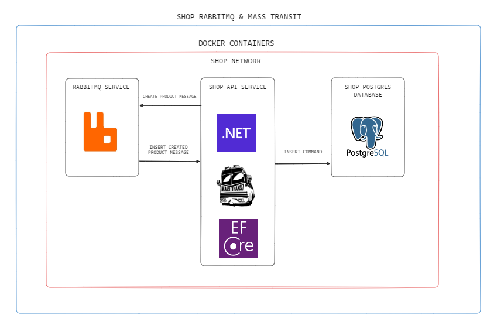

# RabbitMQ and MassTransit Integration

Integrando RabbitMQ em uma minimal api, usando MassTransit para gerencia-lo.

## Arquitetura
#### Em casos reais geralmente usamos duas api's (Consumer e Publisher), porém como o repo tem como finalidade apenas o estudo da integração, temos apenas uma api com as duas responsabilidades.


## Instalação

#### Necessário docker e docker-compose.

```bash
  cd src/docker
  docker-compose up -d
```
